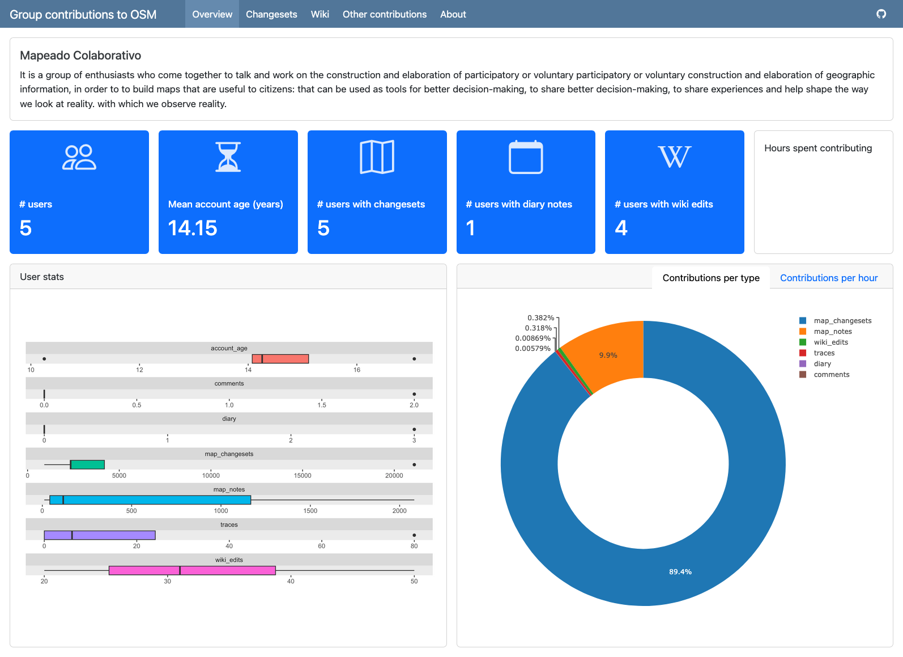

# OSMdashboard

<!-- badges: start -->
[](https://www.repostatus.org/#wip)
[](#contributors)
[](https://github.com/WarwickCIM/OSMdashboard/actions/workflows/R-CMD-check.yaml)

<!-- badges: end -->

> \[!WARNING\]  
> This package is highly experimental and is still a WIP. Expect
> uncomplete features, frequent breaks, uncomplete documentation and changes in the API.

The goal of OSMdashboard is help to understand how different groups of users contribute to OpenStreetMap (OSM). It does so by creating interactive dashboards that visualise OSM-data locally and anonymously, just by filling a `csv` file.

This project follows d'Ignazio and Klein's feminist design principles and the visualisations produced may be useful for anyone interested in better understanding EDI considerations and the dynamics within OpenStreetMap community, including researchers, project managers, and community organizers.




## Acknowledgements

This is an output of the research project _["Can digital goods be neutral? Evaluating OpenStreetMap’s equity through participatory data visualisation"](https://warwick.ac.uk/fac/cross_fac/cim/research/digital-good-neutrality-osm)_ led by Carlos Cámara-Menoyo and Timothy Monteath and funded by the [ESRC Digital Good Network](https://digitalgood.net/) through their Digital Good Research Fund 2024-25. 


## Citing

You are free to use and reuse this tool under the licence conditions.  
If you use this package in your work, please cite it as below:

> Cámara-Menoyo C, Monteath T, Yang S, Rivera Alfaro S, Canclini A (2025). OSMdashboard: Creates OpenStreetMap-related Dashboards. R package version 0.0.0.9000, https://github.com/WarwickCIM/OSMdashboard.

```bibtex
@Manual{,
  title = {OSMdashboard: Creates OpenStreetMap-related Dashboards},
  author = {Carlos Cámara-Menoyo and Timothy Monteath and Selene Yang and Silvia {Rivera Alfaro} and Alejandra Canclini},
  year = {2025},
  note = {R package version 0.0.0.9000},
  url = {https://github.com/WarwickCIM/OSMdashboard},
}
```


## Installation

You can install the development version of OSMdashboard from [GitHub](https://github.com/) with:

``` r
# install.packages("devtools")
devtools::install_github("WarwickCIM/OSMdashboard")
```

This package uses quarto, which is is already installed with RStudio and Positron. In case it is not installed in your system, you will need to install it from [here](https://quarto.org/docs/get-started/).

## Usage

1. Create the dashboard folder structure by calling `create_dashboard()`.
2. Edit the `data/group_info.csv` and `data/group_users.csv` files to add your groups and users.
3. Run `data_retrieval.R` to retrieve the data from OSM.
4. Render `dashboard.qmd` to generate the dashboard.

Refer to the `vignette("dashboard-group-contributions")` for more details.


## Contributors

This project welcomes any type of contributions, not just coding. It follows the [all-contributors](https://allcontributors.org) specification as a way to recognise that, while addressing Katherine d'Ignazio and Lauren F Klein's [principle #7 of Data Feminism: Make Labor Visible](https://data-feminism.mitpress.mit.edu/pub/0vgzaln4/release/3):

> **Make labor visible:** “Starting with questions of data provenance helps to credit the bodies that make visualization possible – the bodies that collect the data, that digitize them, that clean them, and that maintain them. However, most data provenance research focuses on technical rather than human points of origination and integration [66]. With its emphasis on under-valued forms of labor, a feminist approach to visualization can help to render visible the bodies that shape and care for data at every stage of the process. This relates to the concept of provenance rhetoric [44] in which authors of narrative visualizations cite data sources and methods which may help build credibility with the audience.” (Ignazio and Klein, 2016, p. 3)

<!-- ALL-CONTRIBUTORS-LIST:START - Do not remove or modify this section -->
<!-- prettier-ignore-start -->
<!-- markdownlint-disable -->
<table>
  <tbody>
    <tr>
      <td align="center" valign="top" width="14.28%"><a href="https://digitalgood.net/"><br /><sub><b>ESRC Digital Good Network</b></sub></a><br /><a href="#financial" title="Financial">💵</a></td>
      <td align="center" valign="top" width="14.28%"><a href="http://carloscamara.es/en"><br /><sub><b>Carlos Cámara</b></sub></a><br /><a href="https://github.com/WarwickCIM/OSMdashboard/commits?author=ccamara" title="Code">💻</a> <a href="#ideas-ccamara" title="Ideas, Planning, & Feedback">🤔</a> <a href="#design-ccamara" title="Design">🎨</a> <a href="#infra-ccamara" title="Infrastructure (Hosting, Build-Tools, etc)">🚇</a> <a href="#research-ccamara" title="Research">🔬</a> <a href="https://github.com/WarwickCIM/OSMdashboard/commits?author=ccamara" title="Documentation">📖</a></td>
      <td align="center" valign="top" width="14.28%"><a href="https://github.com/timothymonteath"><br /><sub><b>timothymonteath</b></sub></a><br /><a href="#ideas-timothymonteath" title="Ideas, Planning, & Feedback">🤔</a> <a href="#research-timothymonteath" title="Research">🔬</a></td>
      <td align="center" valign="top" width="14.28%"><a href="http://seleneyang.info"><br /><sub><b>Selene Yang</b></sub></a><br /><a href="#ideas-seleneyang" title="Ideas, Planning, & Feedback">🤔</a></td>
      <td align="center" valign="top" width="14.28%"><a href="https://github.com/silvira"><br /><sub><b>silvira</b></sub></a><br /><a href="#ideas-silvira" title="Ideas, Planning, & Feedback">🤔</a></td>
      <td align="center" valign="top" width="14.28%"><a href="https://github.com/malecanclini"><br /><sub><b>malecanclini</b></sub></a><br /><a href="#ideas-malecanclini" title="Ideas, Planning, & Feedback">🤔</a></td>
      <td align="center" valign="top" width="14.28%"><a href="https://github.com/geochicas"><br /><sub><b>Geochicas</b></sub></a><br /><a href="#promotion-geochicas" title="Promotion">📣</a></td>
    </tr>
    <tr>
      <td align="center" valign="top" width="14.28%"><a href="https://github.com/hazelcyril"><br /><sub><b>H CYRIL</b></sub></a><br /><a href="https://github.com/WarwickCIM/OSMdashboard/commits?author=hazelcyril" title="Code">💻</a> <a href="https://github.com/WarwickCIM/OSMdashboard/commits?author=hazelcyril" title="Documentation">📖</a></td>
    </tr>
  </tbody>
</table>

<!-- markdownlint-restore -->
<!-- prettier-ignore-end -->

<!-- ALL-CONTRIBUTORS-LIST:END -->
