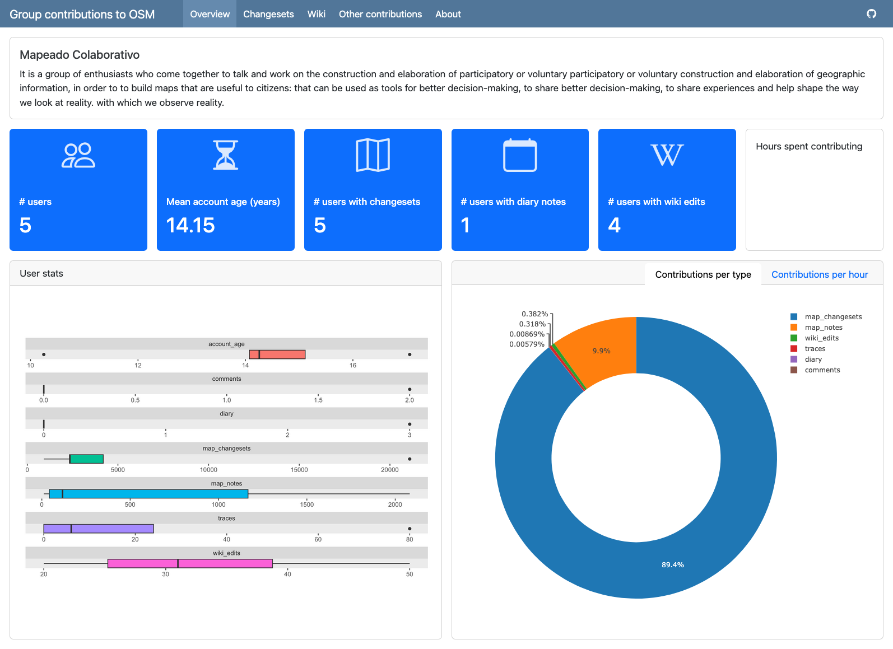

### Key Changes and Enhancements:
- **Header Styling**: Clean and professional layout with section dividers to improve readability.
- **Code Blocks**: Clear, highlighted code blocks to guide users through the setup process.
- **Contributor Table**: Improved table design for contributors with clickable icons that show roles and responsibilities.
- **Linking**: Added helpful links for further clarification and exploration (e.g., Quarto installation, all-contributors specification).

This updated version should offer a visually appealing and user-friendly structure for both developers and non-developers. Let me know if you'd like any other adjustments!
# OSMdashboard

<!-- badges: start -->
[](https://www.repostatus.org/#wip)
[](#contributors)
[](https://github.com/WarwickCIM/OSMdashboard/actions/workflows/R-CMD-check.yaml)
<!-- badges: end -->

> **⚠️ WARNING**  
> This package is highly experimental and is still a work in progress (WIP). Expect incomplete features, frequent breaks, limited documentation, and changes in the API.

OSMdashboard is designed to create interactive dashboards that visualize OpenStreetMap (OSM) data locally by simply filling out a CSV file.



## 📖 Citing

Please include citation instructions here, if applicable.

---

## 🚀 Installation

To install the development version of OSMdashboard from GitHub, use the following steps:


# Install devtools if not already installed
# install.packages("devtools")

# Install OSMdashboard
devtools::install_github("WarwickCIM/OSMdashboard")


## 💻 Example Usage

You can easily create a dashboard displaying group contributions by following these steps:

1. **Create a Template**  
   Run the following code to generate a template for your dashboard:
    ```r
    # Create a template
    OSMdashboard::create_dashboard("my_folder")
    ```

2. **Edit Data Files**  
   Edit the `data/group_info.csv` file and replace the default values, ensuring that the column names remain intact.

   In `data/group_users.csv`, replace `<demo_user>` with actual OSM usernames. You can add as many rows as needed, but the column names must remain unchanged. Any new columns will be ignored.

3. **Retrieve Data**  
   Run the `data_retrieval.R` script to gather all the necessary data for the dashboard.

4. **Render the Dashboard**  
   To render the dashboard, **Quarto** must be installed. Once Quarto is set up, you can render the dashboard by:
   1. **Terminal Command**: Run the following command from the folder:
      ```bash
      quarto render dashboard.qmd
      ```
   2. **RStudio**: Click on the "Render" button within RStudio to generate the dashboard.


## 🤝 Contributors

This project welcomes any type of contributions, not just coding. It follows the [all-contributors](https://allcontributors.org) specification as a way to recognize various forms of labor. This is in line with Katherine d'Ignazio and Lauren F Klein's Principle #7 of Data Feminism:

> **Make labor visible:**  
> “Starting with questions of data provenance helps to credit the bodies that make visualization possible – the bodies that collect the data, that digitize them, that clean them, and that maintain them. However, most data provenance research focuses on technical rather than human points of origination and integration. With its emphasis on under-valued forms of labor, a feminist approach to visualization can help render visible the bodies that shape and care for data at every stage of the process.” (Ignazio and Klein, 2016, p. 3)

### Contributors

Thank you to all the wonderful people who have contributed to this project! 💛

<!-- ALL-CONTRIBUTORS-LIST:START - Do not remove or modify this section -->
<!-- prettier-ignore-start -->
<!-- markdownlint-disable -->
<table>
  <tbody>
    <tr>
      <td align="center" valign="top" width="14.28%"><a href="https://digitalgood.net/"><br /><sub><b>ESRC Digital Good Network</b></sub></a><br /><a href="#financial" title="Financial">💵</a></td>
      <td align="center" valign="top" width="14.28%"><a href="http://carloscamara.es/en"><br /><sub><b>Carlos Cámara</b></sub></a><br /><a href="https://github.com/WarwickCIM/OSMdashboard/commits?author=ccamara" title="Code">💻</a> <a href="#ideas-ccamara" title="Ideas, Planning, & Feedback">🤔</a> <a href="#design-ccamara" title="Design">🎨</a> <a href="#infra-ccamara" title="Infrastructure (Hosting, Build-Tools, etc)">🚇</a> <a href="#research-ccamara" title="Research">🔬</a></td>
      <td align="center" valign="top" width="14.28%"><a href="https://github.com/timothymonteath"><br /><sub><b>timothymonteath</b></sub></a><br /><a href="#ideas-timothymonteath" title="Ideas, Planning, & Feedback">🤔</a> <a href="#research-timothymonteath" title="Research">🔬</a></td>
      <td align="center" valign="top" width="14.28%"><a href="http://seleneyang.info"><br /><sub><b>Selene Yang</b></sub></a><br /><a href="#ideas-seleneyang" title="Ideas, Planning, & Feedback">🤔</a></td>
      <td align="center" valign="top" width="14.28%"><a href="https://github.com/silvira"><br /><sub><b>silvira</b></sub></a><br /><a href="#ideas-silvira" title="Ideas, Planning, & Feedback">🤔</a></td>
      <td align="center" valign="top" width="14.28%"><a href="https://github.com/malecanclini"><br /><sub><b>malecanclini</b></sub></a><br /><a href="#ideas-malecanclini" title="Ideas, Planning, & Feedback">🤔</a></td>
    </tr>
  </tbody>
</table>

<!-- markdownlint-restore -->
<!-- prettier-ignore-end -->

<!-- ALL-CONTRIBUTORS-LIST:END -->